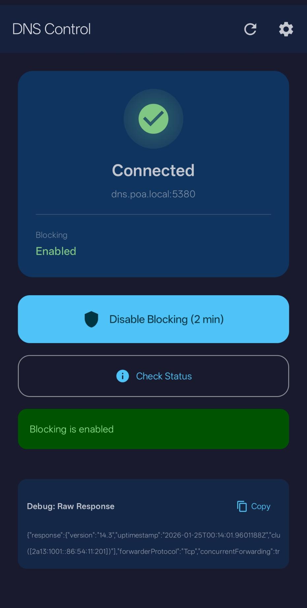
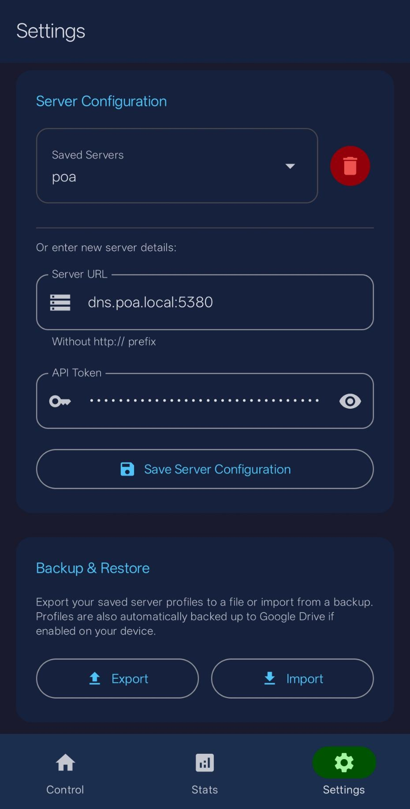

# DNS Control

A modern Android application for controlling DNS blocking on Technitium DNS Server. Temporarily disable ad-blocking and tracker protection with a single tap when you need unrestricted access.

## Features

- **One-Tap Disable** - Temporarily disable DNS blocking for a configurable duration (1-120 minutes)
- **Real-Time Status** - See current blocking status and when it will automatically resume
- **Dashboard Stats** - View query statistics including total queries, cached, blocked, and client counts
- **Auto-Connect** - Automatically checks server connectivity and fetches status on app launch
- **Relative Time Display** - Shows resume time in human-readable format ("in 5 min", "in 1h 30m")
- **Modern UI** - Beautiful Material 3 dark theme with bottom navigation and smooth animations
- **Lightweight** - Minimal permissions, no background services, no tracking

## Screenshots

<p align="center">
  
  &nbsp;&nbsp;&nbsp;
  
</p>

## Requirements

- Android 8.0 (API 26) or higher
- Technitium DNS Server with API access enabled
- Network access to your DNS server

## Installation

### Download APK

Download the latest APK from the [Releases](https://github.com/cbodden/dns-control/releases) page.

### Build from Source

#### Prerequisites

- Android Studio Hedgehog (2023.1.1) or later
- JDK 17 or higher
- Android SDK 34

#### Build Steps

1. Clone the repository:
   ```bash
   git clone https://github.com/YOUR_USERNAME/dns-control.git
   cd dns-control
   ```

2. Open in Android Studio and sync Gradle files, or build from command line:
   ```bash
   ./gradlew assembleDebug
   ```

3. The APK will be generated at:
   ```
   app/build/outputs/apk/debug/app-debug.apk
   ```

#### Release Build

To create a signed release build:

```bash
./gradlew assembleRelease
```

Note: You'll need to configure signing in `app/build.gradle.kts` for release builds.

## Configuration

On first launch, tap the **Settings** icon to configure:

| Setting | Description | Example |
|---------|-------------|---------|
| **Server URL** | Your Technitium DNS server address (without `http://`) | `dns.example.com:5380` |
| **API Token** | Your Technitium API authentication token | `abc123...` |
| **Disable Duration** | How long to disable blocking (1-120 minutes) | `5` |
| **Show Debug Window** | Display raw JSON response on Control tab | `Off` |

### Getting Your API Token

1. Open your Technitium DNS Server web interface
2. Navigate to **Administration** > **Sessions**
3. Create a new API token or use an existing one
4. Copy the token and paste it into the app settings

## Usage

1. **Launch the app** - It will automatically connect to your server and fetch the current status
2. **Control Tab** - The main screen shows:
   - Connection status (Connected/Unreachable)
   - Current blocking state (Enabled/Disabled)
   - Resume time if blocking is temporarily disabled
   - "Disable Blocking" button to temporarily disable DNS blocking
   - "Check Status" button to manually refresh the current state
3. **Stats Tab** - View dashboard statistics for the last hour:
   - Query summary (total queries, errors, NX domain, refused)
   - Resolution types (authoritative, recursive, cached)
   - Blocking stats (blocked, dropped)
   - Server info (clients, zones, cached entries)
   - Zone lists (allowed/blocked zones, allow/block list counts)
4. **Settings Tab** - Configure server URL, API token, disable duration, and debug options
5. **Refresh** - Use the refresh icon in the top bar to re-check connectivity

## API Endpoints Used

This app communicates with Technitium DNS Server using the following API endpoints:

| Endpoint | Method | Purpose |
|----------|--------|---------|
| `/api/settings/get` | GET | Retrieve current server settings including blocking status |
| `/api/settings/temporaryDisableBlocking` | GET | Temporarily disable DNS blocking |
| `/api/dashboard/stats/get` | GET | Retrieve dashboard statistics for the last hour |

### Example API Calls

**Check Status:**
```
GET http://your-server:5380/api/settings/get?token=YOUR_TOKEN
```

**Disable Blocking (5 minutes):**
```
GET http://your-server:5380/api/settings/temporaryDisableBlocking?token=YOUR_TOKEN&minutes=5
```

**Get Dashboard Stats (Last Hour):**
```
GET http://your-server:5380/api/dashboard/stats/get?token=YOUR_TOKEN&type=LastHour&utc=true
```

## Project Structure

```
app/
├── build.gradle.kts                 # App module build configuration
├── src/main/
│   ├── AndroidManifest.xml          # App manifest with permissions
│   ├── java/com/dnscontrol/
│   │   ├── MainActivity.kt          # Main entry point
│   │   ├── MainViewModel.kt         # UI state management & business logic
│   │   ├── data/
│   │   │   └── SettingsDataStore.kt # Persistent settings storage
│   │   ├── network/
│   │   │   └── ApiService.kt        # HTTP API client for Technitium
│   │   └── ui/
│   │       ├── screens/
│   │       │   ├── MainScreen.kt    # Main control screen UI
│   │       │   ├── SettingsScreen.kt# Settings configuration UI
│   │       │   └── StatsScreen.kt   # Dashboard statistics UI
│   │       └── theme/
│   │           └── Theme.kt         # Material 3 dark theme
│   └── res/
│       ├── drawable/                # App icons
│       ├── mipmap-anydpi-v26/       # Adaptive icons
│       └── values/                  # Strings and themes
├── build.gradle.kts                 # Root build configuration
├── settings.gradle.kts              # Gradle settings
└── gradle.properties                # Gradle properties
```

## Tech Stack

- **Language:** Kotlin
- **UI Framework:** Jetpack Compose with Material 3
- **Architecture:** MVVM with StateFlow
- **HTTP Client:** OkHttp
- **Storage:** DataStore Preferences
- **Minimum SDK:** 26 (Android 8.0)
- **Target SDK:** 34 (Android 14)

## Permissions

| Permission | Purpose |
|------------|---------|
| `INTERNET` | Communicate with DNS server API |
| `ACCESS_NETWORK_STATE` | Check network connectivity |

No location, camera, storage, or other sensitive permissions required.

## Troubleshooting

### "Server unreachable" error

- Verify the server URL is correct (without `http://` prefix)
- Ensure your device is on the same network as the DNS server, or the server is accessible remotely
- Check that the Technitium web interface is accessible at the configured port
- Verify your API token is valid

### Buttons not responding

- Check that "isLoading" spinner is not stuck - try refreshing
- Ensure you have network connectivity
- Check the debug output for API response details

### Wrong blocking status displayed

- The app reads the `enableBlocking` field from the Technitium API response
- Use the "Check Status" button to manually refresh
- Check the raw JSON in the debug section to verify server response

## Contributing

Contributions are welcome! Please feel free to submit a Pull Request.

1. Fork the repository
2. Create your feature branch (`git checkout -b feature/AmazingFeature`)
3. Commit your changes (`git commit -m 'Add some AmazingFeature'`)
4. Push to the branch (`git push origin feature/AmazingFeature`)
5. Open a Pull Request

## License

This project is licensed under the MIT License - see the [LICENSE](LICENSE) file for details.

## Acknowledgments

- [Technitium DNS Server](https://technitium.com/dns/) - The DNS server this app is designed to control
- [Jetpack Compose](https://developer.android.com/jetpack/compose) - Modern Android UI toolkit
- [Material Design 3](https://m3.material.io/) - Design system

## Changelog

### v0.2

- Added dashboard stats tab with query statistics
- Added bottom navigation for Control, Stats, and Settings tabs
- Added build info display in Settings
- Added toggle to show/hide debug window on Control tab
- Default server URL is now blank

### v0.1 (Initial Release)

- Initial release with core functionality
- Temporary disable blocking with configurable duration
- Real-time status display with relative time
- Auto-connect and status check on launch
- Settings persistence
- Material 3 dark theme UI
- Debug mode with raw JSON response display
